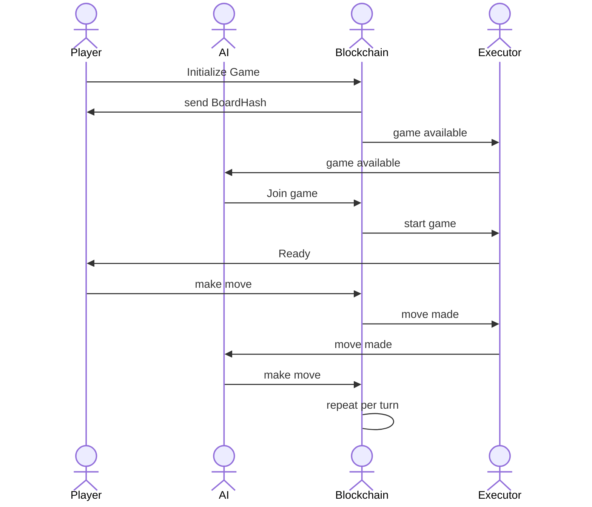

# Hallway Fight Circuit

A testbed for testing Circom circuits.

## How To

### Install

Install 'Circom' using their [downloads](https://docs.circom.io/downloads/downloads/).

`yarn install`

### Test

`yarn mocha tests`

## Basic concepts of the "arena"

### Location

Always specified as (x \* 1000) + y. This allows us to encode [x, y] using one parameter.

### Facing

Starting: N=1, E=2, S=3, W=4

### Commands

| Name    | Value | Description    |
| ------- | ----- | -------------- |
| NULL    | 0     | reserved       |
| FACE_N  | 1     |                |
| FACE_E  | 2     |                |
| FACE_S  | 3     |                |
| FACE_W  | 4     |                |
| FORWARD | 5     | move forward   |
| ATTACK  | 6     | attack forward |

## Circuits

Where - "executor" is GraphQL plus something like Gelato or Chainlink Keepers.
